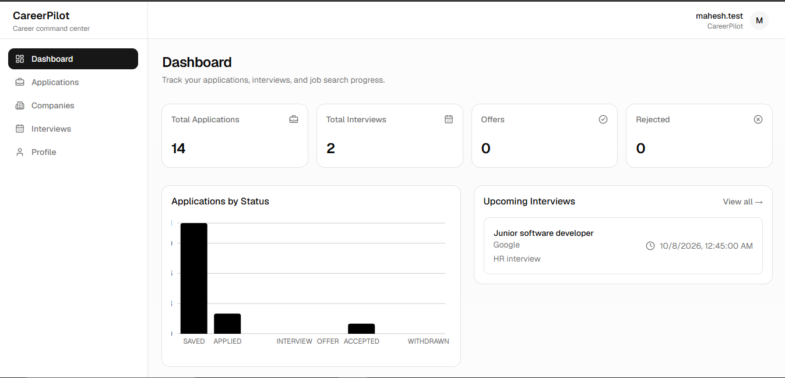
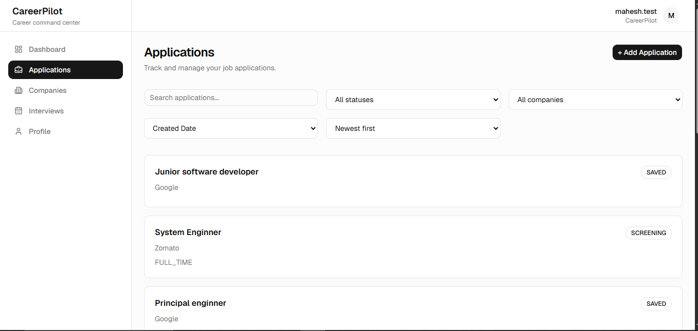
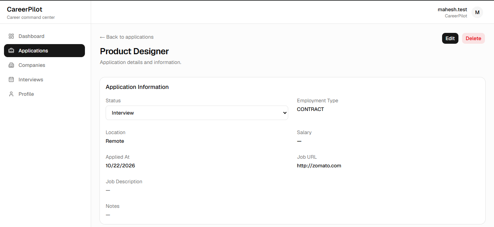
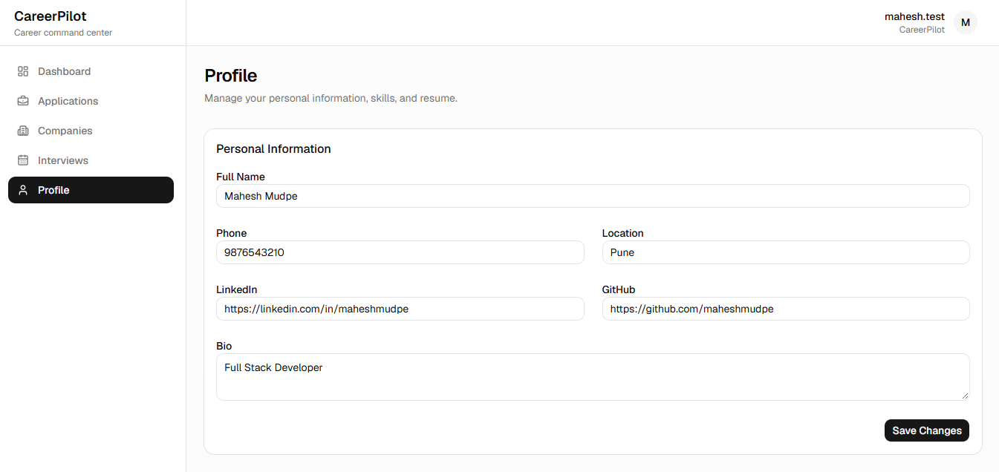

# CareerPilot

CareerPilot is a full-stack job application and interview tracking platform designed to help developers organize their entire job search in one place.

It centralizes applications, companies, interviews, profile information, skills, and resume management into a single workspace.

---

## Problem

During a job search, information is often scattered across job portals, company websites, emails, spreadsheets, and personal notes.

CareerPilot provides a centralized workspace to track:

- Where an application stands
- Which company the application belongs to
- Upcoming interviews
- Interview notes and feedback
- Profile and skills
- Resume
- Overall job search progress

---

## Features

### Authentication

- User registration
- User login
- JWT-based authentication
- Protected API routes
- Authentication rate limiting
- Secure password hashing with Argon2

### Profile

- Personal information
- LinkedIn and GitHub links
- Skills management
- Resume upload
- Resume viewing through signed URLs
- Resume deletion

### Companies

- Create companies
- View company details
- Update companies
- Delete companies
- View associated applications

### Applications

- Create job applications
- Edit applications
- Delete applications
- Application status tracking
- Company association
- Search by job title
- Filter by status and company
- Sorting
- Pagination

### Interviews

- Schedule interviews
- Edit interviews
- Delete interviews
- Interview status tracking
- Interview notes and feedback
- Upcoming interview view
- Application association

### Dashboard

- Total applications
- Total interviews
- Offers
- Rejected applications
- Applications by status
- Recent applications
- Upcoming interviews

---
## Screenshots

### Dashboard

Overview of applications, interviews, offers, rejected applications, application status distribution, and upcoming interviews.



### Applications

Search, filter, sort, and manage job applications by status and company.



### Application Details

View and manage detailed information for an individual job application.



### Profile

Manage personal information, professional links, and career profile details.



## Tech Stack

### Frontend

- React
- TypeScript
- Vite
- Tailwind CSS
- shadcn/ui
- React Router
- Axios
- React Hook Form
- Zod
- Recharts
- Lucide

### Backend

- Node.js
- Express
- TypeScript
- Zod
- JWT
- Argon2
- Helmet
- Express Rate Limit

### Database & Storage

- PostgreSQL
- Drizzle ORM
- Supabase Storage

### Development

- Git
- GitHub
- Docker
- pnpm

---

## Architecture

CareerPilot follows a feature-based full-stack architecture.

```text
CareerPilot
│
├── frontend
│   └── React + TypeScript
│       │
│       ├── app
│       │   ├── auth
│       │   ├── profile
│       │   ├── company
│       │   ├── application
│       │   ├── interview
│       │   ├── file
│       │   └── dashboard
│       │
│       ├── components
│       ├── services
│       ├── hooks
│       ├── routes
│       ├── types
│       └── lib
│
└── backend
    └── Node + Express + TypeScript
        │
        ├── auth
        ├── profile
        ├── company
        ├── application
        ├── interview
        ├── file
        └── dashboard
```

### Backend request flow

The backend follows:

```text
Route
  ↓
Controller
  ↓
Schema Validation
  ↓
Service
  ↓
Database / Storage
```

This separates HTTP handling, validation, business logic, and persistence.

---

## Database

CareerPilot uses PostgreSQL with Drizzle ORM.

### Main entities

```text
Users
  │
  ├── Profile
  ├── Skills
  ├── Companies
  │      │
  │      └── Applications
  │              │
  │              └── Interviews
  │
  └── Files
```

### Main tables

- users
- profiles
- skills
- user_skills
- companies
- applications
- interviews
- files

Database indexes are used for frequently queried fields such as:

- Application user
- Application company
- Application status
- Interview application
- Interview scheduled time
- File user
- File application

---

## Authentication & Security

CareerPilot uses JWT-based authentication.

### Authentication flow

```text
Login
  ↓
Verify password
  ↓
Generate JWT
  ↓
Frontend stores authentication state
  ↓
Axios sends Bearer token
  ↓
Auth middleware verifies JWT
  ↓
Protected route
```

### Security measures include

- Argon2 password hashing
- JWT authentication
- Explicit JWT algorithm verification
- User ownership checks
- Zod validation
- Helmet security headers
- Authentication rate limiting
- Environment variable validation
- Private Supabase Storage
- Signed URLs for private files

User-owned resources are always scoped to the authenticated user's ID.

---

## File Storage

Resume files are stored using Supabase Storage.

```text
Upload
  ↓
Validate file
  ↓
Temporary local storage
  ↓
Supabase private bucket
  ↓
Store metadata in PostgreSQL
```

Supported resume formats:

- PDF
- DOCX

Files are accessed through short-lived signed URLs rather than public storage URLs.

---

## API Structure

Main API resources:

```text
/auth
/profile
/companies
/applications
/interviews
/files
/dashboard
```

Examples:

```text
POST   /auth/register
POST   /auth/login

GET    /profile
PATCH  /profile

GET    /profile/skills
POST   /profile/skills
DELETE /profile/skills/:skillId

GET    /companies
POST   /companies
GET    /companies/:id
PATCH  /companies/:id
DELETE /companies/:id

GET    /applications
POST   /applications
GET    /applications/:id
PATCH  /applications/:id
DELETE /applications/:id

GET    /interviews
POST   /interviews
GET    /interviews/:id
PATCH  /interviews/:id
DELETE /interviews/:id

POST   /files
GET    /files
DELETE /files/:id
GET    /files/:id/url

GET    /dashboard
```

---

## Local Setup

### Prerequisites

Make sure you have installed:

- Node.js
- pnpm
- PostgreSQL or Docker
- Git

### Clone

```bash
git clone <repository-url>
cd jobTrack
```

### Backend

```bash
cd backend
pnpm install
```

Create:

```text
backend/.env
```

Example:

```env
DATABASE_URL=
JWT_SECRET=
JWT_EXPIRES_IN=1h
PORT=8080

SUPABASE_URL=
SUPABASE_SECRET_KEY=
SUPABASE_BUCKET=
```

Then start the backend:

```bash
pnpm dev
```

### Frontend

Open another terminal:

```bash
cd frontend
pnpm install
```

Create:

```text
frontend/.env
```

Example:

```env
VITE_API_URL=http://localhost:8080
```

Start the frontend:

```bash
pnpm dev
```

The application will be available through the Vite development server.

---

## Environment Variables

### Backend

| Variable | Description |
|---|---|
| DATABASE_URL | PostgreSQL connection string |
| JWT_SECRET | Secret used to sign JWTs |
| JWT_EXPIRES_IN | JWT expiration duration |
| PORT | Backend server port |
| SUPABASE_URL | Supabase project URL |
| SUPABASE_SECRET_KEY | Supabase server-side secret |
| SUPABASE_BUCKET | Private storage bucket |

### Frontend

| Variable | Description |
|---|---|
| VITE_API_URL | Backend API URL |

Never commit `.env` files or real credentials.

---

## Project Structure

```text
jobTrack/
│
├── backend/
│   ├── src/
│   │   ├── app/
│   │   │   ├── auth/
│   │   │   ├── profile/
│   │   │   ├── company/
│   │   │   ├── application/
│   │   │   ├── interview/
│   │   │   ├── file/
│   │   │   └── dashboard/
│   │   │
│   │   ├── common/
│   │   ├── config/
│   │   └── db/
│   │
│   └── package.json
│
├── frontend/
│   ├── src/
│   │   ├── app/
│   │   ├── components/
│   │   ├── routes/
│   │   ├── services/
│   │   ├── hooks/
│   │   ├── types/
│   │   └── lib/
│   │
│   └── package.json
│
├── docker-compose.yml
├── .gitignore
└── README.md
```

---

## Engineering Decisions

Some important decisions made during development:

**Feature-based frontend architecture**
Features are separated into domains such as applications, interviews, companies, and profiles instead of placing all pages and logic into large global folders.

**Service-layer backend**
Business logic is kept in services rather than controllers.

**Ownership-based authorization**
Resources are always checked against the authenticated user's ID.

**Database indexes**
Indexes were added according to actual query patterns instead of indexing every column.

**Transactions**
Transactions were introduced only where atomic database operations actually require them. Operations involving external Supabase Storage cannot be made part of a PostgreSQL transaction.

**Rate limiting**
Authentication endpoints are rate-limited to reduce repeated login/register attempts.

**Private file storage**
Resume files are stored privately and accessed using temporary signed URLs.

---

## Future Improvements

Potential future improvements include:

- Production deployment
- Advanced analytics
- Kanban application board
- Email reminders
- Background jobs
- AI-generated interview questions
- Resume feedback
- Redis-based background processing
- Improved application search

These are intentionally outside the current MVP scope.

---

## Demo

CareerPilot demonstrates a complete job-search workflow:

```text
Register
   ↓
Login
   ↓
Create Profile
   ↓
Add Skills
   ↓
Upload Resume
   ↓
Create Company
   ↓
Create Application
   ↓
Track Application Status
   ↓
Schedule Interview
   ↓
Add Interview Notes
   ↓
Monitor Progress from Dashboard
```

---

## Project Status

CareerPilot MVP is complete and undergoing final testing, documentation, and deployment preparation.

---

## Author

**Mahesh Mudpe**
Full-Stack Developer

Built with React, TypeScript, Node.js, Express, PostgreSQL, Drizzle ORM, and Supabase.